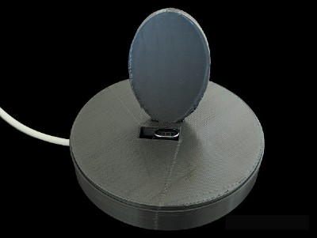

# Charging Stand with Magnetic Adapter

## Introduction

While this charging stand was built specifically for the Google Pixel 4a, it really can be used with any phone. 

## How it Works

The stand houses a magnetic USB adapter. The power is run to the adapter so there's no having to plug your phone into 
a cable when you need to charge. Just have the proper tip plugged into your phone's USB slot and place it on the stand. 
You can leave the tip in your phone if you don't need the port for anything else.

## Parts Needed

The stand is designed to be printed in two pieces and then snapped together.

The base holds the power run and the slot for the USB adapter.

The top has the support for the phone and a slot that exposes the adapter.

- For version 1, I used [this adapter](https://a.co/23xZH8S).
- For versions 2 and 3 I used [this adapter](https://a.co/d/gbPng0D).

## Working with the Code

The STL files are available in this repo.

Version 3 is a complete rework. The base and top are snap fit together using [this library](https://github.com/tbuser/pin_connector) from tbuser.

The phone rest is more substantial and should not weaken over time and use.

To print a heavier base, I recommend 80-85% infill. You're welcome to reduce/raise that it all depends on how much
filament you want to end up using.

If you want to work with the code I've used toggles for the following:

* Show base
* Show top
* Show pins

### If You Want to Contribute

If you'd like to add support for different adapters or other features, you are more than welcome to add toggles to the 
code base. Just submit a pull request, and we'll get it in there!
