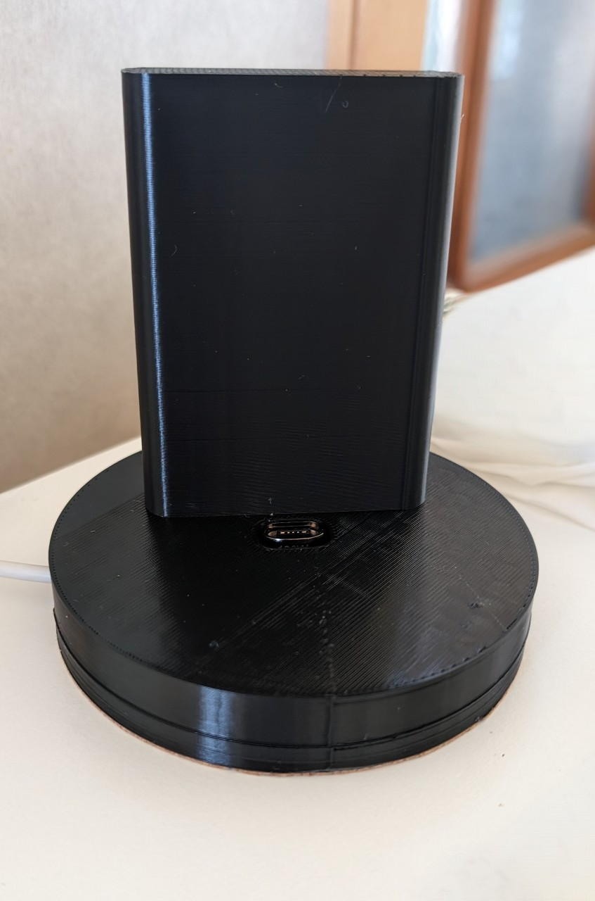

# Charging Stand for Google Pixel 4a

## Introduction

While this charging stand was built specifically for the Google Pixel 4a, it really can be used with any phone. I tested
it with my Google Pixel 7. The stand can support no case or a thin case. It wasn't designed to support anything heavy 
duty like an Otterbox or similar.

## How it Works

The stand houses a magnetic USB adapter. The power is run to the adapter so there's no having to plug your phone into 
a cable when you need to charge. Just have the proper tip plugged into your phone's USB slot and place it on the stand. 
You can leave the tip in your phone if you don't need the port for anything else.

## Parts Needed

The stand is designed to be printed in two pieces and then snapped together.

The base holds the power run and the slot for the USB adapter.

The top has the support for the phone and a slot that exposes the adapter.

I used [this adapter](https://a.co/23xZH8S).

## Working with the Code

The STL files are available in this repo and I plan on sharing it on Thingiverse and Cults. 

If you want to work with the code I've used toggles for the following:

* Show base
* Show Top
* Left side power

The last toggle allows provides support for the power cable to come into the base from the left instead of the right
side.

### If You Want to Contribute

If you'd like to add support for different adapters or other features, you are more than welcome to add toggles to the 
code base. Just submit a pull request, and we'll get it in there!
